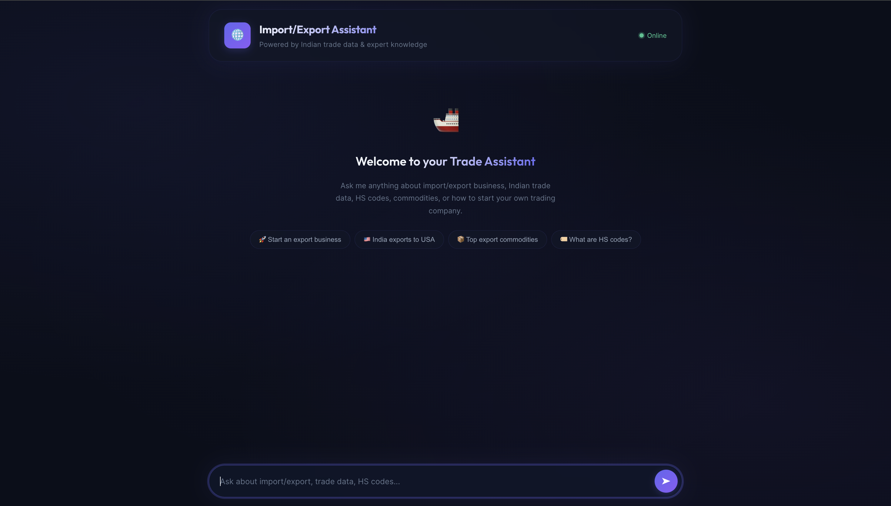
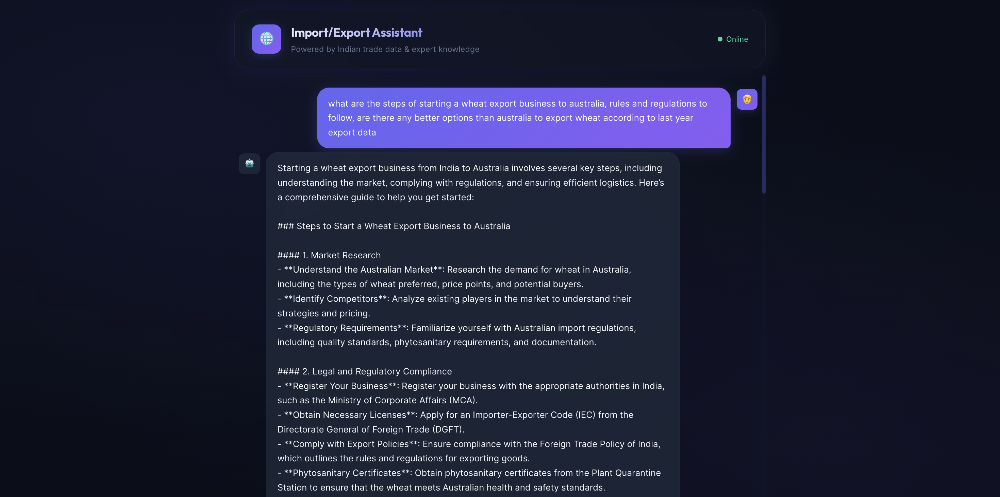
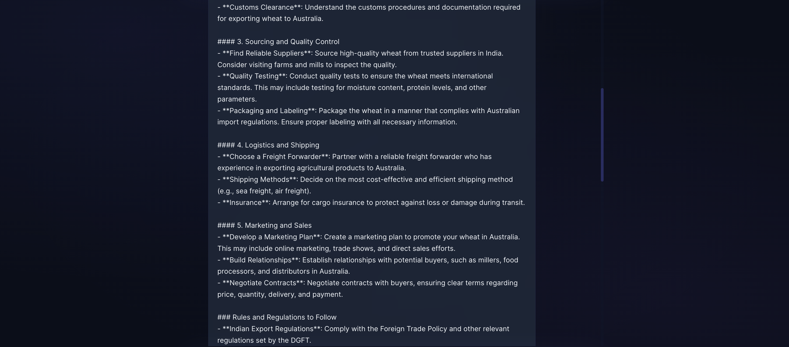
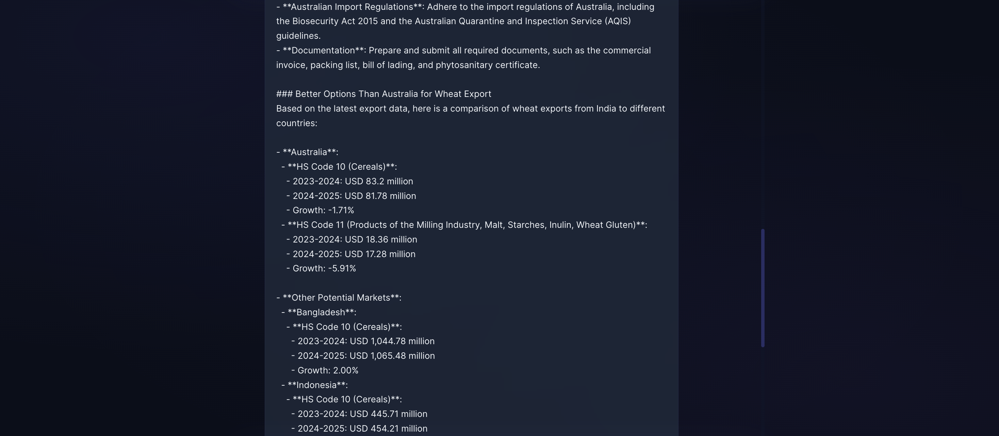
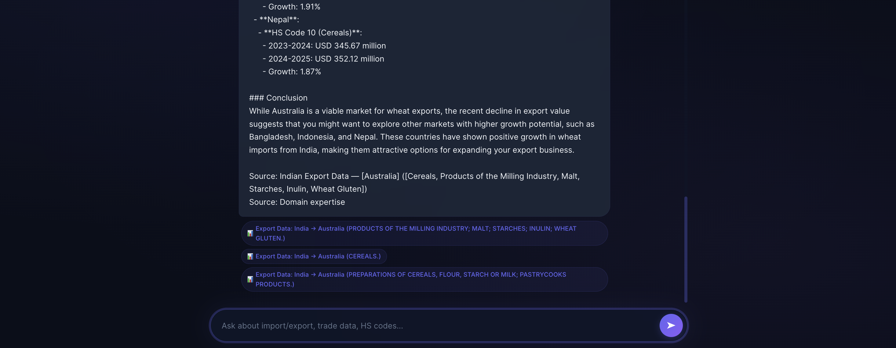

# Import/Export Assistant

A project that builds an Import/Export Business chatbot using a Retrieval-Augmented Generation (RAG) pipeline. The system combines procedural guidance from a trade business knowledge base with Indian export data, and returns answers with source citations. Users can also **upload their own business data** to receive personalised, data-driven suggestions for growing their export business.

---

## 1. Introduction

### 1.1 Context and motivation

Entrepreneurs and businesses involved in import and export need both procedural guidance and reliable trade statistics. This project creates a chatbot that answers questions from a curated knowledge base: a standard import/export business reference and Indian export data from TRADESTAT-style sources. The system uses RAG so answers are grounded in sources and can be cited, rather than relying only on the language model’s training.

### 1.2 Importance of import–export trade

International trade connects countries, firms, and consumers. Imports bring goods and inputs that may be cheaper, higher quality, or unavailable domestically. Exports open new markets, earn foreign exchange, and support jobs and growth. For India, trade activity is central to economic development and global integration. For entrepreneurs, import–export offers the chance to scale beyond local markets but requires understanding regulations, logistics, finance, and demand.

### 1.3 Retrieval-Augmented Generation (RAG) — brief explanation

RAG combines search with language generation. The user question is used to retrieve relevant passages from a stored collection of documents or data, then those passages are passed to a language model as context. The model generates an answer grounded in the retrieved context, which reduces hallucinations and allows source citations.

### 1.4 How RAG can help entrepreneurs in import–export

RAG helps by:

- answering "how-to" questions from trusted guides and manuals,
- answering "what are the numbers?" questions from official trade statistics,
- showing where the answer came from,
- staying aligned with your selected knowledge base.

### 1.5 Objectives

- Provide a single conversational interface for procedural guidance and trade-data questions.
- Ground answers in designated documents and datasets.
- Use Indian export statistics so trade-data answers are authoritative.
- Allow users to upload their own business data (CSV, Excel, PDF) for personalised recommendations.
- Cross-reference user data with the knowledge base to identify growth opportunities and risks.
- Design the pipeline to support future data updates and new source types.

### 1.6 System overview

The chatbot uses a knowledge base composed of:

- a trade business reference book,
- Indian export data in a merged CSV,
- trade law and regulation knowledge.

The system operates in two modes:

1. **Standard mode** — answers questions using the RAG knowledge base.
2. **Personalised mode** — when a user uploads their business data, the system combines the uploaded data with RAG-retrieved knowledge to give tailored suggestions.

The system supports entrepreneur-style questions, trade-data queries, personalised business analysis, and general import/export questions.

### 1.7 Document structure

This README is organised into: introduction, system flow, data preparation, ingestion, query pipeline, web application, implementation status, advantages, applications, future scope, and sample conversations.

---

## 2. High-Level System Flow

The system is organised into four stages:

| Stage | Name | Mode | Description |
|:-----:|------|------|-------------|
| **0** | Data Preparation | Offline / Admin | Acquire and prepare source documents and export data. |
| **1** | Data & Ingestion | Offline / Admin | Parse, chunk, embed, and store content in a vector database. |
| **2** | Query → Answer | Online | Retrieve relevant chunks and generate answers with citations. |
| **3** | Web Application | Online | Chat UI and backend API that invoke the RAG pipeline. |

**End-to-end flow (standard mode):**

```
User → Web UI → Backend API → RAG (Retrieve + LLM) → Answer + Citations → User
```

**End-to-end flow (personalised mode with file upload):**

```
User uploads file → Backend parses → Summary stored in session
User asks question → RAG retrieves trade KB chunks
                   → LLM gets: RAG context + user's business data
                   → Personalised answer with citations → User
```

**Offline pipeline:**

```
Data Preparation → Parse → Chunk → Enrich → Embed → Store (Vector DB)
```

**Online pipeline:**

```
User Question → Embed Query → Retrieve Top-k → Build Context → LLM → Answer + Sources
```

---

## 3. Stage 0: Data Preparation

### 3.1 Purpose

Collect, structure, and organise source materials before ingestion. This stage ensures the book and export data are in a consistent form.

### 3.2 Process

| Step | Description |
|------|-------------|
| **Source acquisition** | Obtain the book text and Indian export data. |
| **Schema / structure** | Ensure export data has `country_from`, `country_to`, `HSCode`, `Commodity`, year value columns, and growth. |
| **Data cleaning** | Normalise text and validate numeric export values. |
| **Organisation** | Keep book text under `data/book/`, export CSV under `data/export/`, and law KB under `data/`. |

### 3.3 Outputs

- Book reference content ready for chunking.
- Merged Indian export CSV ready for ingestion.

### 3.4 Extensibility

New export data or book sections can be added and re-ingested without retraining the model.

---

## 4. Stage 1: Data & Ingestion

### 4.1 Purpose

Convert raw sources into searchable chunks and store them with embeddings in a vector database.

### 4.2 Process

| Step | Description |
|------|-------------|
| **Parse** | Extract text from book sources and load export CSV rows. |
| **Chunk** | Split book text into digestible passages; create data chunks for export rows or grouped country/commodity segments. |
| **Enrich** | Attach metadata for source type, chapter, country, HS code, and commodity. |
| **Embed** | Generate embeddings for each chunk using a shared model. |
| **Store** | Save chunks and embeddings in a vector database such as Pinecone. |

### 4.3 Outputs

- A vector database comprised of book chunks and export data chunks.
- Metadata to distinguish book content from export data.

### 4.4 Extensibility

Additional export years, new countries, or future dispute data can be added to the same pipeline.

---

## 5. Stage 2: Query → Answer

### 5.1 Purpose

For each user query, retrieve relevant context from the knowledge base and generate an answer with citations.

### 5.2 Process

| Step | Description |
|------|-------------|
| **Query embedding** | Convert the user question into an embedding. |
| **Retrieval** | Search the vector database for top-k relevant chunks. |
| **Context building** | Format retrieved chunks with source labels. |
| **Generation** | Send the user question plus retrieved context to the LLM. |
| **Response** | Return structured output with `answer` and `sources`. |

### 5.3 Outputs

- Answer text grounded in the knowledge base.
- Source citations for verification.

---

## 6. Stage 3: Web Application Flow

### 6.1 Purpose

Expose the RAG pipeline through a user-facing chat interface, including file upload for personalised analysis.

### 6.2 Process

| Step | Description |
|------|-------------|
| **User opens app** | The chat UI loads in the browser. |
| **User uploads file** *(optional)* | User clicks 📎 to upload business data (CSV, Excel, PDF, TXT). Backend parses and stores a summary. |
| **User submits question** | The frontend sends the message to the backend. |
| **Backend processing** | The backend runs retrieval and LLM generation. If a file was uploaded, the user's data is injected into the prompt alongside RAG context. |
| **Frontend display** | The answer and colour-coded source tags appear in the chat. |
| **Follow-up** | Multi-turn dialogue is supported; uploaded data persists for the session. |
| **Remove file** | User can click ✕ on the file badge to return to standard mode. |

### 6.3 Architecture

- Frontend: `templates/chat.html` and `static/style.css`
- Backend: `app.py` with RAG logic, file upload routes, and API endpoints
- Retrieval engine: Pinecone vector store
- LLM: HuggingFace endpoint via `langchain-huggingface`

### 6.4 File Upload — Personalised Suggestions Feature

#### 6.4.1 Purpose

Allow export business owners to upload their own business data so the chatbot can analyse it and provide personalised, data-backed recommendations by cross-referencing with the trade knowledge base.

#### 6.4.2 Supported file formats

| Format | Extension | Parsing method |
|--------|-----------|----------------|
| CSV | `.csv` | `pandas.read_csv()` — auto-detects columns, builds summary with stats |
| Excel | `.xlsx`, `.xls` | `pandas.read_excel()` — same as CSV |
| PDF | `.pdf` | `PyPDFLoader` — extracts text from all pages |
| Plain text | `.txt` | Direct text read |

#### 6.4.3 How it works

1. **Upload**: User clicks the 📎 button and selects a file (max 5 MB).
2. **Parse**: The backend (`src/helper.py → parse_uploaded_file()`) reads the file and produces a structured text summary (~2000 chars max).
3. **Store**: The summary is kept in server memory for the session duration.
4. **Query**: When the user asks a question, the backend builds a personalised prompt that includes:
   - The user's business data summary (from the uploaded file)
   - RAG-retrieved context (from book, export data, and trade laws in Pinecone)
5. **Answer**: The LLM cross-references both sources to give specific, actionable recommendations.
6. **Clear**: User can remove the file at any time to switch back to standard mode.

#### 6.4.4 Personalised analysis capabilities

The personalised prompt instructs the LLM to:

- Analyse the user's current export products, markets, and revenue.
- Compare with Indian export trends from the knowledge base.
- Identify growth opportunities — new markets, high-growth commodities, untapped regions.
- Flag potential risks — declining markets, over-concentration.
- Give specific, data-backed recommendations with numbers.
- Cite both the user's data and the trade knowledge base.

#### 6.4.5 API endpoints

| Endpoint | Method | Description |
|----------|--------|-------------|
| `/` | GET | Serve the chat UI |
| `/get` | POST | Handle chat messages (standard or personalised mode) |
| `/upload` | POST | Upload and parse a business data file |
| `/clear-upload` | POST | Remove uploaded data and return to standard mode |

#### 6.4.6 Privacy

- Uploaded files are parsed and immediately deleted from disk.
- Only the text summary is kept in server memory for the session.
- No uploaded data is stored permanently.

---

## 7. Summary

| Stage | Main output |
|:-----:|-------------|
| **0** | Prepared book and export data sources |
| **1** | Vector DB with embeddings |
| **2** | Retrieved answer with citations |
| **3** | User-facing chat app |

This system combines trusted documentation and official trade data into one conversational assistant.

---

## 8. Implementation Updates

### 8.1 Data sources in this repository

- **Book knowledge**: `data/book/` (book text or extracted content)
- **Indian export data**: `data/export/merged_country_wise.csv`
- **Trade laws KB**: `data/import_export_laws_knowledge_base.txt`

### 8.1.1 Public dataset on Kaggle

The merged Indian export dataset has also been published on Kaggle under a CC0 license. Anyone can download and reuse it from:

- https://www.kaggle.com/datasets/udaydhakad/export-data-of-india-2024-2025

This makes the dataset available publicly for research and reuse.

### 8.2 Current status

The repository includes the chat application and the data sources needed for the RAG pipeline. The app loads embeddings, connects to Pinecone, and serves the chat UI.

---

## 9. Result Update

### 9.1 Dataset summary

The export dataset is prepared as a merged CSV with columns such as:

- `country_from`
- `country_to`
- `S.No.`
- `HSCode`
- `Commodity`
- `2023-2024`
- `2024-2025`
- `%Growth`

### 9.2 Cleaning and preparation

The data is normalised for missing values, dropped summary rows, and standardised for ingestion.

### 9.3 Next steps

- finish ingestion of book and export data
- complete retrieval and LLM integration
- improve the web UI and deploy the app

---

## 10. Advantages

- Grounded answers from curated sources
- Colour-coded source citations (📊 export data, 📖 book, 📜 trade laws) for transparency
- Official-style Indian export statistics
- One interface for both procedural guidance and trade data
- **Personalised suggestions** based on user-uploaded business data
- Cross-referencing of user data with national trade statistics for actionable insights
- Easy to extend with new datasets
- Privacy-conscious: uploaded files are parsed and not stored permanently

---

## 11. Applications

- Entrepreneur guidance on export/import business setup
- Trade market research with country and commodity figures
- **Personalised business analysis** — upload sales data to get market expansion recommendations
- **Risk assessment** — identify over-concentrated markets or declining product categories
- **Growth opportunity identification** — find high-growth commodities and untapped export destinations
- Educational support for trade and customs topics
- Future extension to dispute guidance and case-based support

---

## 12. Workflow for Remaining Work

1. Parse and chunk book + export data.
2. Embed chunks and store in Pinecone.
3. Build the query pipeline with retrieval, prompt assembly, and LLM generation.
4. Finalise the chat UI and deploy.

---

## 13. Future Scope

- Add dispute data and case references
- Add multilingual support
- Add voice and chatbot analytics
- Integrate with real trade portals or customs APIs
- Support multi-sheet Excel workbooks with sheet selection
- Add persistent file storage with user accounts
- Generate downloadable PDF reports from personalised analysis
- Auto-generate an initial business health analysis upon file upload

---

## 14. Sample Conversations

### 14.1 Standard mode

**User:** How do I start an export business?

**Chatbot:**
1. Research product-market fit.
2. Register your business and obtain IEC.
3. Source quality suppliers and arrange logistics.
4. Comply with customs, certificates, and export regulations.
5. Find buyers and negotiate contracts.

📚 Sources:
- 📖 Import/Export Business Book — Page 12
- 📜 Trade Laws & Regulations KB — FTDR Act
- Domain expertise

**User:** What does India export to Australia?

**Chatbot:**
India exports commodities such as cereals and processed food products to Australia. The system can cite export data by HS code and value for FY 2023–2024 and 2024–2025.

📚 Sources:
- 📊 Indian Export Data — Australia (CEREALS, HS 10)

---

### 14.2 Personalised mode (after file upload)

**User:** *Uploads `my_sales_data.csv` containing their export products, revenue, and destinations.*

**Chatbot:** 📂 File "my_sales_data.csv" loaded successfully! I can now give you personalised suggestions based on your business data.

**User:** Which new markets should I target?

**Chatbot:**
Based on your current exports of organic spices to the USA ($120K) and UAE ($95K), I recommend:

1. **United Kingdom** — India's spice exports to the UK grew 18% in 2024–2025. Your product line aligns well.
2. **Germany** — HS 0910 (spices) saw 12% growth to Germany; currently underserved by your portfolio.
3. **Diversification risk**: 65% of your revenue comes from USA — consider spreading to 3–4 markets.

📚 Sources:
- 📊 Uploaded Business Data — revenue breakdown by country
- 📊 Indian Export Data — UK (SPICES, HS 0910)
- 📊 Indian Export Data — Germany (SPICES, HS 0910)
- 📖 Import/Export Business Book — Page 87
- Domain expertise

---

## Setup and Run

```bash
cd /Users/udaydhakar12/Documents/project_impexp
python3 -m venv .venv
source .venv/bin/activate
pip install -r requirements.txt
python app.py
```

Open `http://localhost:8080`.

## Environment variables

Create `.env` with:

```env
PINECONE_API_KEY=your_pinecone_api_key
HUGGINGFACEHUB_ACCESS_TOKEN=your_huggingface_api_token
```

## Screenshots











---

## Important files

- `app.py` — Flask backend, RAG pipeline, file upload routes (`/upload`, `/clear-upload`)
- `src/prompt.py` — system prompt (standard mode) and upload prompt (personalised mode)
- `src/helper.py` — embedding setup, file parsing (`parse_uploaded_file`)
- `templates/chat.html` — chat interface with 📎 upload button and file badge
- `static/style.css` — UI styling with colour-coded source tags
- `store_index.py` — offline ingestion pipeline for Pinecone
- `data/export/merged_country_wise.csv` — Indian export dataset
- `data/book/` — import/export business reference book (PDF)
- `data/import_export_laws_knowledge_base.txt` — trade laws and regulatory knowledge
- `requirements.txt` — Python dependencies (includes `openpyxl` for Excel upload support)
- `docs/` — screenshot assets

## Notes

This README is inspired by the project report structure and shows how the system flow maps to the current repository. The screenshots are included to visualise the app experience and results.
